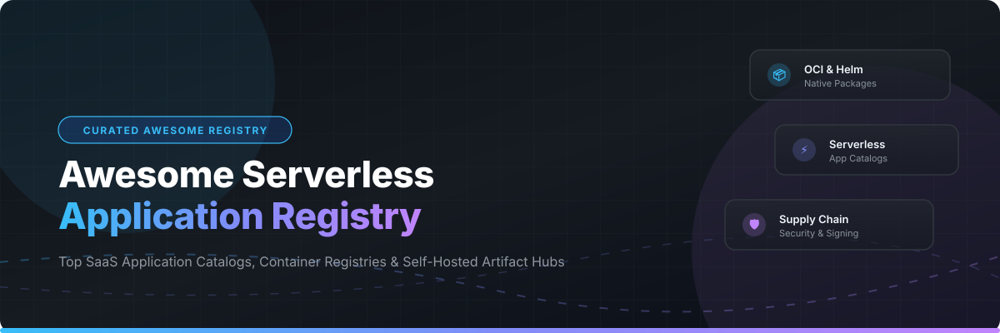

# Awesome-Serverless-Application-Registry

  
  
  
  
  
  

---

## 🚀 Overview & Ecosystem Scope

**Awesome Serverless Application Registry** is a definitive, community-curated catalog of **SaaS Application Registries**, **OCI Container Registries**, **Helm Chart Hubs**, and **Self-Hosted Artifact Repositories**. These tools form the essential software distribution layer for modern cloud-native architectures, serverless deployments, microservices, and Kubernetes applications.

Whether you are seeking managed cloud registries with global CDNs or self-hosted open-source registries with zero-trust vulnerability scanning, this list provides clear breakdowns of features, pricing, free tiers, and repository popularity.

---

## 📑 Table of Contents

- [☁️ SaaS & Hosted Platforms](#️-saas--hosted-platforms)
- [🔓 Open-Source GitHub Projects](#-open-source-github-projects)
- [🛠️ Key Selection Criteria](#️-key-selection-criteria)
- [🤝 How to Contribute](#-how-to-contribute)
- [⚠️ Disclaimer](#️-disclaimer)
- [⭐ Star History](#-star-history)
- [💖 Support & Community](#-support--community)

---

## ☁️ SaaS & Hosted Platforms

> 📊 **Market Insights (2026)**: The global Cloud-Native Artifact & Container Registry sector is estimated at **$2.8 Billion in 2026** (growing at an 18.5% CAGR). The sector is **moderately concentrated**, dominated by cloud hyperscalers (AWS, Microsoft GitHub, Docker) for hosted distribution, while maintaining a vibrant long-tail ecosystem of specialized multi-format artifact managers and self-hosted open-source platforms.

The table below lists leading managed SaaS registries sorted by **Company Size / Valuation (Descending)**:

| 🏢 Product | 📝 Description | 💵 Starting Tier Price | 🎁 Free Tier Limit | 📈 Valuation / Revenue |
| :--- | :--- | :--- | :--- | :--- |
| **[GitHub Container Registry (GHCR)](https://github.com/features/packages)** | GitHub's container & OCI package registry integrated directly with GitHub Actions & workflow permissions. | **$0.25 / GB / month** storage (Beyond free tier; Team plan starts at **$4 / user / month**) | **500 MB storage & 1 GB transfer / month** (100% Free forever for public packages) | **$3.10 Trillion** *(Microsoft)* |
| **[AWS Serverless Application Repository](https://aws.amazon.com/serverless/serverlessrepo/)** | AWS's managed public/private repository to publish, discover, and deploy serverless applications & SAM templates with one-click IAM integration. | **$0.10 / GB / month** storage + **$0.005 / 1,000 API requests** | **1 GB storage & 10,000 requests / month** (AWS Free Tier forever) | **$2.10 Trillion** *(Amazon)* |
| **[Bitnami Application Catalog](https://bitnami.com/stacks)** | Enterprise-grade, pre-packaged open-source container and Helm chart catalog certified for multi-cloud Kubernetes platforms. | **$1,500 / month** *(VMware Tanzu Application Catalog enterprise subscription)* | **100% Free access** to public Bitnami container images & Helm chart catalog | **$750.0 Billion** *(Broadcom)* |
| **[Red Hat Ecosystem Catalog & Quay.io](https://quay.io/)** | Enterprise container registry featuring automated vulnerability scanning, geo-replication, and certified OpenShift operator distribution. | **$15 / month** *(Quay Developer plan; OpenShift managed node at **$208 / node / year**)* | **Unlimited free public repositories** & **60-day OpenShift developer sandbox trial** | **$200.0 Billion** *(IBM / Red Hat)* |
| **[GitLab Package Registry](https://docs.gitlab.com/ee/user/packages/)** | Multi-format package and container registry natively built into GitLab CI/CD pipelines and security governance. | **$29 / user / month** *(GitLab Premium plan)* | **5 GB storage & 10 GB transfer / month** *(GitLab Free plan forever)* | **$8.5 Billion** *(GitLab Inc)* |
| **[Docker Hub](https://hub.docker.com/)** | The world's largest container registry and default reference registry for Docker desktop & container distribution. | **$5 / user / month** *(Docker Pro plan)* | **1 public repo, 1 private repo, 200 pulls / 6 hours** rate limit | **$2.1 Billion** *(Docker Inc / ~$150M ARR)* |
| **[Cloudsmith](https://cloudsmith.com/)** | Cloud-native universal artifact management supporting 25+ package formats over a worldwide edge CDN with compliance policy enforcement. | **$15 / user / month** *(Cloudsmith Starter plan)* | **14-day free trial** (up to 50 GB storage & 50 GB bandwidth) / Free for open source | **$150 Million** *(Cloudsmith Inc / $26M Raised)* |
| **[Artifact Hub](https://artifacthub.io/)** | CNCF hosted hub aggregating Helm charts, OCI artifacts, Kubernetes Operators, and Falco security policies. | **$0.00 / month** *(100% Free open-source public service)* | **Unlimited public repositories, packages, and search indexing** (100% Free forever) | **Non-Profit / Foundation** *(CNCF)* |

---

## 🔓 Open-Source GitHub Projects

Below is a comprehensive list of top self-hosted open-source registries, container toolkits, and artifact platforms, sorted strictly by **GitHub Stars_Count (Descending)**:

1. **[Gitea](https://github.com/go-gitea/gitea)**  — **58,300+ ⭐**  
   *Painless self-hosted Git service and DevOps platform featuring built-in package management for Docker, OCI, Helm, npm, PyPI, Maven, and Cargo.* 🍵

2. **[Harbor](https://github.com/goharbor/harbor)**  — **29,500+ ⭐**  
   *The de facto CNCF graduated enterprise container registry featuring security vulnerability scanning (Trivy), RBAC, image signing (Cosign), and replication.* 🚢

3. **[Verdaccio](https://github.com/verdaccio/verdaccio)**  — **17,900+ ⭐**  
   *Lightweight, zero-config Node.js private proxy registry for npm packages with local caching and custom authentication.* 📦

4. **[Grype](https://github.com/anchore/grype)**  — **13,000+ ⭐**  
   *Fast vulnerability scanner for container images, filesystems, and software packages supporting multiple vulnerability databases.* 🛡️

5. **[Distribution (Docker Registry v2)](https://github.com/distribution/distribution)**  — **10,600+ ⭐**  
   *The CNCF reference implementation toolkit for packing, storing, and delivering OCI container content.* 🐳

6. **[Syft](https://github.com/anchore/syft)**  — **9,600+ ⭐**  
   *CLI tool and Go library for generating a Software Bill of Materials (SBOM) from container images and filesystems.* 🔍

7. **[Kraken](https://github.com/uber/kraken)**  — **6,800+ ⭐**  
   *Uber's open-source peer-to-peer (P2P) Docker registry capable of distributing TBs of image data across thousands of hosts in seconds.* ⚡

8. **[Cosign](https://github.com/sigstore/cosign)**  — **6,350+ ⭐**  
   *Sigstore's container signing, verification, and supply chain transparency tool for OCI registries.* 🔑

9. **[Kubeapps](https://github.com/vmware-tanzu/kubeapps)**  — **5,100+ ⭐**  
   *Web-based dashboard to discover, deploy, and manage Helm charts and Kubernetes applications within clusters.* 🕸️

10. **[ChartMuseum](https://github.com/helm/chartmuseum)**  — **3,800+ ⭐**  
    *Open-source Helm chart repository server with support for cloud storage backends (AWS S3, Google Cloud Storage, Azure Blob).* ⛵

11. **[Docker Registry UI](https://github.com/Joxit/docker-registry-ui)**  — **3,500+ ⭐**  
    *Clean and intuitive web frontend UI for private Docker Registry v2 and OCI container repositories.* 🖼️

12. **[Dragonfly](https://github.com/dragonflyoss/dragonfly)**  — **3,300+ ⭐**  
    *CNCF incubating P2P data distribution and image acceleration system for cloud-native container runtimes.* 🐉

13. **[Portus](https://github.com/SUSE/Portus)**  — **2,980+ ⭐**  
    *Authorization service and administration frontend for Docker Registry v2 (Archived historical reference).* 🗝️

14. **[zot](https://github.com/project-zot/zot)**  — **2,830+ ⭐**  
    *A production-ready, vendor-neutral, scale-out OCI-native container image and artifact registry.* ⚡

15. **[Quay](https://github.com/quay/quay)**  — **2,820+ ⭐**  
    *Red Hat's open-source container registry platform providing secure storage, build triggers, and vulnerability scanning.* 🏗️

16. **[Nexus Repository OSS](https://github.com/sonatype/nexus-public)**  — **2,660+ ⭐**  
    *Universal artifact repository manager supporting Maven, npm, PyPI, Docker, Helm, Go, and NuGet packages.* 🏛️

17. **[ORAS CLI](https://github.com/oras-project/oras)**  — **2,460+ ⭐**  
    *OCI Registry as Storage CLI for pushing non-container artifacts, Helm charts, and custom blobs to OCI registries.* 📁

18. **[Artifact Hub Engine](https://github.com/artifacthub/hub)**  — **2,100+ ⭐**  
    *The open-source web application engine driving CNCF Artifact Hub for discovering cloud-native packages.* 🌐

19. **[Artipie](https://github.com/artipie/artipie)**  — **690+ ⭐**  
    *Self-hosted binary artifact registry written in Java supporting multi-language repositories in a single instance.* 🧩

20. **[Pulp Core](https://github.com/pulp/pulpcore)**  — **600+ ⭐**  
    *Platform for managing software package repositories, mirror syncs, and distribution for Linux distributions & containers.* 🍊

---

## 🛠️ Key Selection Criteria

When selecting an application registry architecture, evaluate:

1. **Protocol & Artifact Support**: Does it support standard OCI Distribution Specs, Helm v3 charts, SAM templates, or multi-language package managers (npm, PyPI, Maven)?
2. **Supply Chain Security**: Does it integrate cryptographic signing ([Cosign](https://github.com/sigstore/cosign)), vulnerability scanning ([Grype](https://github.com/anchore/grype)), and automated SBOM generation ([Syft](https://github.com/anchore/syft))?
3. **Bandwidth & Geo-Replication**: For large-scale Kubernetes clusters, leverage P2P distribution systems like [Kraken](https://github.com/uber/kraken) or [Dragonfly](https://github.com/dragonflyoss/dragonfly) to prevent registry bandwidth bottlenecks.
4. **Total Cost of Ownership (TCO)**: Balance cloud managed egress/storage costs against self-hosted infrastructure maintenance, storage backups, and HA operations.

---

## 🤝 How to Contribute

Contributions are welcome! Please follow these simple guidelines:

1. Fork this repository.
2. Update `README.md` maintaining consistent table or list formatting.
3. For SaaS products, include exact pricing tiers, free forever/trial limits, and parent company valuation.
4. For Open-Source projects, ensure the repo has a social Stars_Badge linking directly to `/stargazers`.
5. Submit a concise Pull Request describing your additions.

Explore more curated awesome lists at [Awesome-Awesome-Awesome](https://github.com/ishandutta2007/Awesome-Awesome-Awesome)!

---

## ⚠️ Disclaimer

- This list is **community-curated** for information purposes.
- Public registries do not guarantee security filtering. Always use vulnerability scanners and signed artifacts before deploying container images to production environments.
- Proprietary pricing and free tiers are subject to vendor changes.

---

## ⭐ Star History

---

## 💖 Support & Community

Thank you for exploring **Awesome Serverless Application Registry**! If you find this curated list valuable for your DevOps workflows and cloud architecture planning:

- ⭐ **Star** this repository to show your appreciation and help others discover it.
- 🍴 **Fork** it to keep your own reference copy or contribute updates.
- 📢 **Share** it with your platform engineering team, colleagues, and social networks.
- ☕ **Sponsor / Buy a Coffee**: Support ongoing open-source curation and project maintenance via [GitHub Sponsors](https://github.com/sponsors/ishandutta2007).

  <b>Made with ❤️ for Platform Engineers, Cloud Architects, and DevOps Teams.</b>

